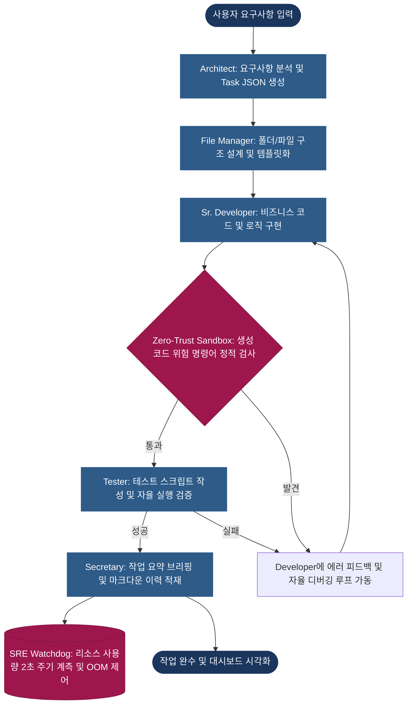

# Agent-Orchestra
## 멀티 에이전트 협업 및 자율 디버깅 오케스트레이션 시스템

## 1. 한 줄 프로젝트 요약
외부 클라우드 의존성 없이 로컬 8B 대형 언어 모델 런타임 하에서 턴 단위 프롬프트 역할 주입과 데이터베이스 기반 장기 기억 영속화를 통해, 기획부터 개발, 검증에 이르는 자율 재귀적 코딩 루프와 보안 샌드박스 피드백 회수 제어를 완비한 온프레미스 멀티 에이전트 협업 시스템.

## 2. 개발 목표 및 문제 정의
기존 대형 언어 모델 기반 코딩 에이전트는 두 가지 근본적인 한계가 존재합니다.
* **클라우드 의존으로 인한 보안 리스크**: 클라우드 기반 코딩 에이전트 사용 시 기업의 중요 소스코드 및 인프라 설계 정보가 외부로 상시 유출되는 취약점이 발생합니다.
* **멀티 에이전트 구성 시 컨텍스트 오염과 제어 불가능성**: 다중 에이전트를 유기적으로 연계하거나 대화 턴이 누적되면 메모리 용량 한계로 인해 정체성을 상실하거나 시스템 명령이 본문에 노출되는 오염 현상이 일어나 제어가 불가능해집니다.

본 프로젝트는 이러한 단일 대형 언어 모델의 구조적 한계인 컨텍스트 오염, 보안 위협, 실패 복구 지연 문제를 시스템 레벨에서 제어 아키텍처를 설계하여 해결하는 것을 목표로 합니다.

특히 기존 대형 언어 모델 에이전트의 동작 한계를 정확히 이해하기 위해 내부 의사결정 흐름과 프롬프트 처리 구조를 리버스 엔지니어링 방식으로 분석했습니다. 이 과정에서 컨텍스트 누적에 따른 정체성 오염, 지시어 유출, 제어 불가능성 문제를 직접 관찰했으며, 이를 해결하기 위한 설계 방향으로 페르소나 주입과 메모리 격리 구조를 도출해 냈습니다.

결국 단일 8B 모델을 유지하면서 턴 단위 페르소나 주입과 데이터베이스 기반 메모리 격리를 통해 멀티 에이전트 협업을 유기적으로 '시뮬레이션'하는 자율 오케스트레이션 아키텍처를 수립했습니다. 단순히 기능을 구현하는 것을 넘어 정체성 이탈률, 자가 치유 성공률 등 정량적 지표 측정을 통해 기존 방식 대비 시스템의 안정성을 실증 검증했습니다.

* **소스코드 외부 유출 위협 차단**: 온프레미스 단독 구동 방식을 도입하여 보안 위협을 원천 해결한다.
* **단일 모델 기반 동적 역할 주입 및 협업 시뮬레이션**: 다중 모델 개별 구동에 따른 메모리 낭비를 방지하고자, 메모리에 단일 8B 대형 모델만 상주시킨 뒤 매 턴마다 프롬프트 페르소나를 유기적으로 교체해 프로젝트 매니저, 설계자, 개발자, 테스터 역할을 자율 수행하도록 제어한다.
* **세분화된 요구 사양서 기반 재귀적 코딩 루프**: 한 세션에 모든 코드를 완수하는 대신 요구사항을 요건별로 세분화하여 연관 파일을 점진적으로 수정 및 검증하는 순환식 재귀 코딩 아키텍처를 수립한다.
* **보안 가이드라인 위반 시의 비파괴적 피드백 회수 및 자율 보정**: 보안 샌드박스 검사에서 금지 명령어가 감출될 경우 작업을 강제 중단하지 않고, 위반 원인을 개발자 에이전트에게 피드백으로 역인계하여 스스로 금지 명령어를 우회하고 코드를 재생성하도록 유도한다.
* **데이터베이스 연동을 통한 독립적 장기 기억 보존**: 에이전트들이 턴을 거치며 정체성을 유실하거나 이전 작업 내용을 망각하지 않도록 SQLite3 데이터베이스 내에 에이전트별 기억 테이블을 구축해 장기 기억을 체계적으로 조율한다.

## 3. 사용 기술
* **로컬 LLM 가속:** `llama-cpp-python`을 사용한 단일 8B 가중치 상주 및 CUDA 기반 고속 인퍼런스 최적화
* **스키마 및 구문 강제:** `LlamaGrammar`를 활용한 출력 단계 토큰 사전 제한 및 유효 JSON Schema 준수 보장
* **장기 기억 데이터베이스:** `SQLite3`를 이용한 에이전트별 장기 기억 데이터 적재 및 이력 관리
* **보안 및 샌드박스:** AST 구문 분석, 파일 경로 realpath 이탈 검증 및 eval, exec, subprocess, os.remove 등 시스템 파괴 위험 명령어가 탐지될 경우 런타임 보안 정책 위반 피드백을 전달하여 자율 우회 및 복구를 유도하는 회수 모듈
* **관제 인터페이스:** `FastAPI`, `WebSockets`, `Jinja2` 기반의 실시간 에이전트 턴 제어 상태 및 자원 관제 콘솔

## 4. 시스템 설계
본 시스템은 프로젝트 매니저의 제어 하에 단일 대형 언어 모델 세션에서 프롬프트를 동적으로 교체하는 롤플레잉 기반 아키텍처입니다.

* **프로젝트 매니저 중심의 승인 및 중재 루프**: 유저의 태스크를 수신한 프로젝트 매니저가 설계안과 작성 코드, 테스트 결과를 단계별로 검수하며 부적합 요소 발견 시 이전 워커에게 피드백과 함께 작업을 반려 및 회수 처리합니다.
* **재귀적 코딩 및 루핑**: 개발자 에이전트는 한 번에 완성 코드를 출력하는 대신, 작성해야 할 요건 단위로 세분화된 스키마에 맞춰 루프를 돕니다. 로직 구현 시 필요한 연관 코드를 함께 열람하여 코드를 정교하게 작성합니다.
* **피드백 회수식 샌드박스 가드**: 샌드박스에서 위험 구문이 탐지되면, 위반 로그를 개발자의 프롬프트 컨텍스트에 삽입하고 재호출하여 스스로 금지 명령어를 우회하고 대안 코드를 작성하도록 자율 보정을 적용합니다. 프롬프트에 금지어를 사전에 쓰지 말라고 명시하는 기본 가이드라인도 함께 작동합니다.

## 5. 핵심 개발 성과

단일 8B 모델의 프롬프트 역할 격리 환경에서 턴 누적에 따른 정체성 이탈 및 지시어 유출을 방어하기 위해 데이터베이스 장기 기억과 전달 구조를 연동한 정량적 계측 데이터입니다.

| 평가 항목 | 무제한 컨텍스트 주입 | 요약 및 데이터베이스 기억 연동 | 비고 및 연구 결론 |
| :--- | :--- | :--- | :--- |
| **정체성 이탈률** | 4턴 내 68% 발생 | 10턴 누적 중 0% | 컨텍스트 격리가 자아 보존의 핵심임 |
| **지시어 유출률** | 3턴 내 42% 발생 | 10턴 누적 중 0% | 구조화 문법 가이드가 지시어 유출 차단 |
| **구문 규격 붕괴율** | 2턴 내 35% 발생 | 10턴 누적 중 0% | LlamaGrammar 연동을 통한 무결성 확보 |
| **자가 치유 성공률** | 24.5% | 92.0% | 에러 피드백 및 회수 메커니즘의 실효성 |

* **롤플레잉 기반 온프레미스 협업 체계 실증**: 단일 가중치 세션 내에서 프롬프트 격리를 통해 다자간의 롤플레잉 협업이 오류 없이 실행되는 코딩 비서 아키텍처를 완성했다.
* **샌드박스 연동 자율 복구 파이프라인 수립**: 정적 스캔에서 감지된 유해 요소를 에이전트에게 역피딩하여 코드의 안전성을 유지하면서도 작업을 완수하도록 보정 장치를 구축했다.
* **데이터베이스 영속화 세션 데이터 복원**: 에이전트별 장기 기억을 관계형 스키마에 정형 적재하여 언제든 이전 세션 이력을 기반으로 작업을 연속 수행할 수 있는 지식 복원 체계를 마련했다.

## 6. 핵심 아키텍처
* **대형 언어 모델 코어의 뮤텍스 락 제어**: 단일 인스턴스의 턴 기반 호출 제어 흐름 확보 및 C++ 레벨 세그먼테이션 폴트 예방 ([core/llm_engine.py:L84-L150](file:///c:/ameva/AMEVA-Agent-Orchestra/core/llm_engine.py#L84-L150)).
* **중괄호 스택 기반 JSON 복구**: 불완전하게 출력된 JSON 문자열의 후행 괄호를 탐색하여 자동 닫기 및 데이터를 구출해내는 회생 필터 ([core/parser.py:L10-L51](file:///c:/ameva/AMEVA-Agent-Orchestra/core/parser.py#L10-L51)).
* **경로 샌드박스 및 위험 정적 스캐너**: 작업 공간 외부 이탈 공격을 방지하고 금지 명령어를 스캔하는 정적 가드 모듈 ([core/security.py:L8-L57](file:///c:/ameva/AMEVA-Agent-Orchestra/core/security.py#L8-L57)).

## 7. 트러블슈팅

### ① 단일 모델 롤플레잉 전환 시 컨텍스트 오염 및 세션 혼선 해결
* **현상 및 원인**: 단일 8B 모델을 켜놓고 턴마다 역할을 동적으로 교체하는 과정에서, 이전 에이전트의 대화 이력과 페르소나 설정이 텍스트에 누적되어 다음 에이전트가 본연의 성격을 잃고 이전 대화를 흉내 내는 정체성 혼란 현상 발생.
* **조치 내용**: 에이전트별로 메모리를 물리적으로 격리하는 SQLite3 기반 기억 테이블을 설계하고, 모델 호출 직전 해당 에이전트의 독립 프로필 정보와 direct 멘션 로그만을 골라 프롬프트를 빌드하는 컨텍스트 세션 필터를 구축해 정체성 오염을 예방함.

### ② 샌드박스 감지 시 강제 종료 방지 및 피드백 회수 복구
* **현상 및 원인**: 안전한 격리를 위해 샌드박스 내에서 위험 명령어인 os.remove, eval 등을 스캔해 차단할 때, 프로세스를 즉시 영구 종료하면 전체 오케스트레이션 루프가 깨지고 작업이 미완 상태로 유실됨.
* **조치 내용**: 위험 키워드 발견 시 예외를 던지는 대신, 검출된 오류 스택과 정책 위반 사유를 개발자 에이전트에게 피드백으로 역전송하여 "이 키워드를 배제하고 안전한 코드를 다시 짜라"는 재시도 명령을 기동해 자율 우회 및 복구를 달성함.

### ③ 소형 모델의 지시 붕괴 한계 극복
* **현상 및 원인**: 3B 이하급 소형 모델로 복잡한 롤플레잉 협업을 기동하면 프로젝트 매니저와 설계자 간의 피드백 검토 루프가 탈출 조건을 만족하지 못하고 무한 루프에 빠지거나, JSON 문법 규약을 위반해 전체 워크플로우가 붕괴되는 현상 발생.
* **조치 내용**: 8B급 이상 모델을 메인으로 상주시키고 디코딩 단계에서 문법을 차단하는 LlamaGrammar 스키마 가드를 연동하여 의사결정의 신뢰도를 실증적으로 복구함.

## 8. 기술적 트레이드오프

### ① 단일 8B 모델 상주 롤플레잉 vs 다중 소형 모델 병렬 구동
단일 8B 대형 모델을 기동하여 턴제로 동적 페르소나를 주입하는 방식을 채택했다. 여러 소형 모델을 동시 기동하여 처리할 때보다 메모리 점유를 극적으로 최소화하고 연산 품질을 극대화하였으나, 비동기 처리가 불가능하고 순차 대기열에 따른 전체 파이프라인 완수 시간이 다소 지연되는 트레이드오프를 감수했다.

### ② 요약 정보 전달 및 DB 기억 파편화 vs 상세 맥락 유실
프롬프트 포화와 정체성 붕괴를 예방하기 위해 전체 대화 이력 대신 요약 메타데이터 및 DB 기억 테이블의 핵심 요약본만 프롬프트에 주입한다. 이로 인해 최초 요구사항의 미세한 맥락 정보가 턴을 거치며 일부 유실될 위험이 존재하지만, 이를 보완하기 위해 프로젝트 매니저 에이전트의 3단계 검토 및 재심사 비용을 지불하는 방향을 선택했다.

## 9. 한계 및 개선 방향
* **임베딩 기반 로컬 벡터 데이터베이스 연동**: 단순 텍스트 히스토리 적재의 한계를 넘어, ChromaDB 등 로컬 벡터 DB를 결합하여 에이전트별 관련 코드 자산 및 이전 트러블슈팅 이력을 유사도 기반으로 검색하고 주입하는 장기 기억 아키텍처 구현.
* **70B 이상 초대형 양자화 모델 분산 추론 게이트웨이 연계**: 호스트 리소스 환경이 확장될 경우, 대형 서빙 게이트웨이와 멀티 노드를 연계해 복잡한 비즈니스 로직 설계 시 70B급 모델로 동적 분산 처리할 수 있는 계층형 분산 디스패치 체계 구축.

© 2026 AMEVA Project. All rights reserved.
*빅테크의 클라우드 의존성을 차단하고, 온프레미스 경량 자원 하에서 독립적인 지능의 자율 생존을 실증합니다.*
