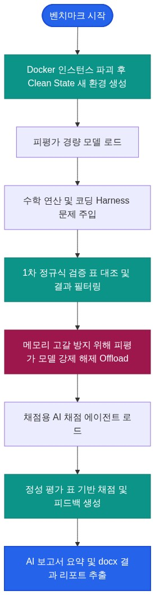

# AMEVA Benchmark Suite
## 컨테이너 기반 엣지 네이티브 LLM 평가 플랫폼 개발 포트폴리오

## 1. 한 줄 프로젝트 요약
실제 엣지 디바이스 테스트 환경을 Docker 가상 컨테이너로 완벽히 구축 및 격리하여, 신규 로컬 LLM의 언어능력과 수학/코딩 성능과 환각 증세를 공정하게 자동 검증하고 결과 보고서 작성 및 요약까지 전 과정을 자동화 및 AI화한 오프라인 벤치마킹 플랫폼 구현.

## 2. 개발 목표
- 외부 환경 및 호스트 OS 간섭이 없는 완전히 격리된 독립 가상 컨테이너 환경을 제공하여, 피평가 모델의 물리적 추론 지표와 실행 안전성을 투명하게 검증하는 것을 목표로 한다.
- **오프라인 샌드박스 기반 추론 및 정량 검증 자동화**: 사용자의 벤치마크 명령 접수와 즉시 Docker 가상 컨테이너를 구동하고 평가용 경량 모델을 빌드하여 테스트 데이터셋을 주입한다. 이후 모델의 응답에 대해 1차 정규식 Regex 가이드를 이용해 코딩 규칙 준수 및 환각 Hallucination 오류 여부를 인간 개입 없이 완전 자동으로 필터링한다.
- **8B급 로컬 모델 연계형 채점 및 진단 기술 보고서 자동 작성**: 1차 검증 이후 피평가 모델을 메모리에서 완전히 회수하고, 8B급 이상의 고성능 AI 채점 에이전트 EXAONE-3.5 7.8B 등을 적재해 정성 평가를 실시한다. 채점 점수 및 평가 요약 내용을 SQLite3 데이터베이스에 기록하고, 최종적으로 이를 종합한 공식 기술 진단 보고서 docx 파일 일괄 생성을 자동으로 완결한다.

## 3. 사용 기술 (Tech Stack)
- **컨테이너 격리 제어**: Docker SDK (가상 샌드박스 생명주기 및 리소스 할당 최적화 제어)
- **실시간 로그 뷰어**: WebSocket, PyWebview (비동기 추론 로그 실시간 스트리밍 및 모니터링 인터페이스)
- **AI 채점 에이전트**: EXAONE-3.5 7.8B (8B급 이상의 정성 평가 및 피드백 생성 전담 로컬 LLM)
- **피평가 모델**: Qwen2.5 (1.5B/3B), Llama-3.1/3.2 (8B/1B), DeepSeek-R1-Distill 등 경량 모델
- **보고서 생성 및 AI 요약**: python-docx, SQLite3, 8B급 이상 로컬 LLM (평가 데이터 요약 및 공식 Word 문서 결과 리포트 일괄 자동 생성)

## 4. 시스템 설계
- **완전 격리형 평가 아키텍처**: 모델을 변경하고 벤치마크 수행할 때마다 Docker 컨테이너 데몬을 통해 이전 인스턴스를 파괴, 새로운 가상 환경을 띄워 모델을 로드하도록 제어
- **순차 로딩 제어**: 엣지 환경의 VRAM 한계를 우회하기 위해, 평가 모델의 태스크 추론이 끝나면 RAM/VRAM에서 해당 모델을 100% 해제 Offload한 뒤에야 AI 채점 에이전트 모델을 메모리에 올리는 교차 순차 제어 구조를 설계

## 5. 핵심 결과
수학 및 코드 논리 연산에 대해 자동화된 1차 필터링과 8B급 이상의 고성능 로컬 AI 채점 에이전트를 연계한 정밀 검증 모델을 확립했습니다.
- **채점 하드웨어 구성**: AI 채점 에이전트는 피평가 모델이 메모리에서 완벽히 소거된 후 로딩되며, 엣지 환경에서 정교한 한국어 문맥 이해가 검증된 8B급 로컬 언어 모델 EXAONE-3.5 7.8B 또는 동급을 사용하여 정량/정성 교차 검증을 진행합니다.

### 프롬프트 지시사항 준수 및 Strict 셋팅
- 피평가 모델이 지정된 JSON 출력 형식을 준수하거나, 번역 등의 지시사항을 왜곡 없이 출력하도록 프롬프트 가이드라인을 극도로 엄격하게 통제(Strict 설정)했다.
- 응답의 일관성을 확보하고 환각이나 무작위 답변을 방지하기 위해 생성 파라미터의 `Temperature = 0.0`으로 강제 고정했다. 또한, 시스템 프롬프트 최하단에 스키마 규칙(`Output format must be valid JSON: {"score": int, "reason": string}`)을 강제로 반복 주입하여 프롬프트 탈옥 및 형식 오류를 억제했다.

### 1차 정규식 검증표 (정량적 기호 및 환각 검증)
| 검증 항목 | 주요 대상 | 정규식 매칭 기준 | 처리 방식 |
| :--- | :--- | :--- | :--- |
| 수학 연산 정확도 | 사칙연산 및 방정식 결과 | 숫자형 결과 및 수식 문맥 매칭 | 정답 데이터 일치 여부 판별 |
| 환각 방지 검증 | 팩트 체크 및 근거 진위 | 모른다는 표현 및 특정 회피 키워드 매칭 | 거짓 생성 답변 탐지 시 즉시 Fail 처리 |

### 2차 정성 평가 채점표 (AI 채점 에이전트 피드백 로직)
| 점수 대역 | 판정 기준 (응답 품질) | 피드백 로직 |
| :--- | :--- | :--- |
| 9 ~ 10점 | 지시 의도를 정확히 파악하고 예외 처리까지 완벽한 코드/수식 제공 | 가산점 부여 근거를 상세 사유에 보존 |
| 7 ~ 8점 | 방향성은 맞으나 세부 디테일이 부족하거나 포맷이 일부 누락됨 | 감점 요인 지적 및 보완 코드를 포함해 피드백 제공 |
| 0 ~ 3점 | 질문과 무관하거나, 오답 및 심각한 환각으로 사용 불가한 수준 | 감점 사유를 즉시 DB에 적재하고 오답 피드백 처리 |

## 6. 핵심 구현 및 설계 포인트
- **전 단계 자동화 및 AI 평가 파이프라인**: 사용자 지시 입력부터 격리 컨테이너 구동, 피평가 모델의 추론 실행, 1차 정량 기호 검증, 8B급 이상의 로컬 AI 채점 에이전트를 통한 평가 및 요약, 최종 보고서(.docx) 생성까지 이어지는 전 과정을 인간의 수동 개입 없는 오프라인 파이프라인으로 설계 및 자동화했다.
- **프롬프트 Strict 제어를 통한 안정적인 파싱**: 피평가 모델과 채점 에이전트에 엄격한 구조화 가이드 및 Temperature 제어를 걸어, 저비트 양자화 모델 런타임에서도 파이프라인 붕괴를 예방하고 일관된 출력 정합성을 획득했다.

## 7. 트러블슈팅
### AI 채점 에이전트의 파싱 에러로 인한 전체 파이프라인 중단
- **현상 및 원인**: AI 채점 에이전트가 정성 평가 사유를 작성할 때 줄바꿈, 특수 따옴표 및 HTML 기호 등을 혼용하면서 JSON 파싱 에러가 발생했고, 대기 중이던 평가 태스크들이 연속적으로 블로킹되며 파이프라인 전체가 멈추는 시스템 락 현상이 나타남.
- **조치 내용**: 정답 원문의 포맷 오류와 상관없이 점수 값과 사유 텍스트 영역을 물리적으로 파싱해내는 '정규식 기반 자가 복구 로직'을 도입하여 예외 복구력을 강화하고 파이프라인 정체를 원천 차단함.

### 엣지 단말기 메모리 초과로 인한 데몬 강제 종료
- **현상 및 원인**: 물리 VRAM 8GB 미만의 저사양 테스트 환경에서 피평가 모델의 추론 태스크와 AI 채점 에이전트의 구동이 중첩되어 적재될 때, 시스템 전체 Out of Memory 크래시가 발생해 테스트 데몬이 죽는 현상 발생.
- **조치 내용**: 추론 단계 완료 시점에서 피평가 모델 가속 라이브러리의 해제 API를 명시적으로 호출해 메모리를 비우고, 가비지 collector 강제 구동을 완료한 직후 채점 모델을 바인딩하는 순차 실행 시퀀스를 스레드 워커 레벨에서 동기식 제어하여 해결함.

## 8. 기술적 트레이드오프
### Clean State 환경 생성 딜레이 vs 성능 계측의 공정성
- 테스트 세션이 전환될 때마다 컨테이너 인스턴스를 파괴하고 다시 올리는 과정에서 약 2~3초의 대기 시간이 지속적으로 발생한다. 그러나 이전 모델이 실행 중 발생시킨 자원 간섭, OS의 가상 캐싱, 디렉터리 찌꺼기가 후속 테스트의 추론 시간 and 정확도 계측을 왜곡하는 것을 완벽히 방지하여 결과 데이터 신뢰성을 100% 보장하는 방향을 채택했다.

### 웹 기반 렌더링 서버 분리 vs 리소스 소비
- 통합형 로컬 실행 파일 대신 웹 인터페이스 프레임워크를 분리 가동함에 따라 미세한 네트워크 오버헤드가 발생한다. 하지만 이를 통해 벤치마크 대상 모델이 추론할 때 메인 루프 가속 리소스를 GUI 스레드가 방해하지 않도록 독립성을 제공하고, 이후 사내 기기들끼리 테스트 서버를 공유하기 용이한 환경을 마련하는 이점을 챙겼다.

## 9. 한계 및 개선 방향
- **다양한 아키텍처 및 OS 런타임 검증 한계**: 리소스가 제약된 싱글 호스트 머신에서 엣지와 유사한 상태를 시뮬레이션했으나, ARM 아키텍처 기반 싱글보드 컴퓨터, 맥 OS의 통합 메모리 관리 방식 등 기기별 특수한 OOM 트리거 방식과 이기종 연산 환경에 이르기까지 완벽히 세분화하여 계측하는 데는 하드웨어 조달 한계가 존재했다.
- **향후 로드맵 및 개선 방향**:
  - **평가 하한선 기반 모델 자동 폐기 필터 구축**: 벤치마크 평가 지표와 채점 에이전트의 종합 평가 점수가 미리 설정된 최소 임계치 이하(예: 평균 5.0점 미만 또는 크리티컬 환각 1회 이상 발생)로 판정될 경우, 해당 모델을 사내 배포 후보군에서 자동으로 배제하고 컨테이너 자원을 즉각 영구 폐기(Deprecate)하는 자동 정화 수명 주기(Clean Lifecycle)를 도입할 예정이다.
  - **분산 테스트 그리드 구축**: 개별 기기(Fleet)에 벤치마크 에이전트를 데몬 형태로 탑재하여 테스트 자원을 분산하고, 중앙 MLOps 서버에서 통합적으로 측정 결과를 집계 및 비교할 수 있는 분산 벤치마크 그리드 시스템을 연동할 예정이다.
