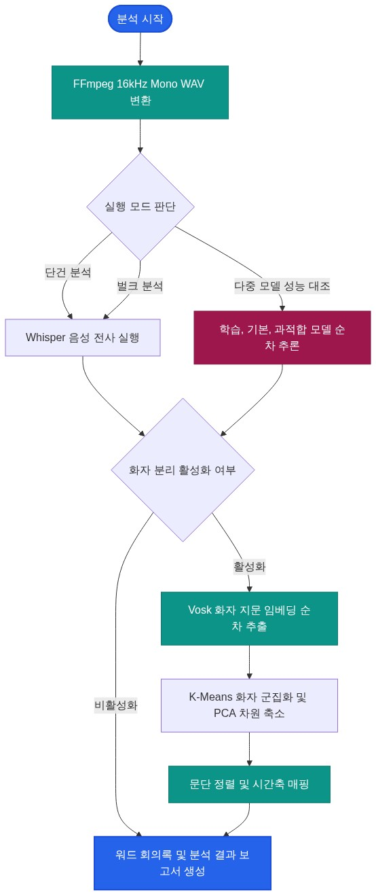

# STT-Agent
## 로컬 Whisper-Vosk 하이브리드 화자 분리 및 회의록 자동 생성 시스템

## 1. 한 줄 프로젝트 요약
음성 인식 기능과 Vosk 화자 임베딩 기술을 결합하여 다중 화자 대화를 분석하고, 워드 회의록을 생성하는 하이브리드 화자 분리 및 회의록 자동 생성 시스템 구현.

## 2. 개발 목표
* 사내 회의 정보가 외부로 유출되는 문제를 원천 차단하고, 네트워크가 차단된 완전 폐쇄망 환경에서 안전하게 화자 분리 회의록을 자산화할 수 있는 온프레미스 회의록 자동 생성 시스템을 구축한다.
* 동일 오디오 소스에 대해 학습된 버전, 기본 버전, 과적합된 버전 등 다양한 성능의 모델들을 동시에 가동하여 전사 품질을 교차 비교하고 정량 평가할 수 있는 대조 분석 환경을 제공한다.
* 여러 추론 모델 가동 시 발생하는 메모리 부족 문제를 해결하고, 대량의 음성 파일을 단건 혹은 배치 단위로 유연하게 처리할 수 있는 안정성 제어 아키텍처를 구현한다.

## 3. 사용 기술
* **음성 처리 및 변환:** FFmpeg 활용 16kHz 단일 채널 표준 오디오 변환
* **음성 인식:** faster-whisper 기반 로컬 양자화 모델 구동
* **화자 지문 임베딩:** Vosk 한국어 및 화자 모델 기반 임베딩 추출
* **군집화 및 차원 축소:** scikit-learn 및 numpy 활용 군집화와 멱반복법 주성분 분석
* **보고서 렌더링:** python-docx 기반 비교 보고서 자동 생성

## 4. 시스템 설계
본 시스템은 음성 처리 제어와 다중 모델 비교 평가에 초점을 맞춰 설계되었습니다. 사용자는 단건 오디오 분석부터 대용량 배치 처리까지 유연하게 운용할 수 있습니다.

* **화자 분리 및 평가 제어 스위칭:** 분석 목적에 따라 화자 분리 적용 여부를 선택적으로 온/오프할 수 있으며, 단일 파일 처리와 입력 디렉터리 신규 파일을 감시하여 처리하는 벌크 모드 및 배치 주기 실행 모드를 모두 지원합니다.
* **다중 모델 다차원 교차 비교:** 동일한 음성 파일에 대해 학습된 타이니, 일반 타이니, 과적합 타이니 등 서로 다른 가중치 모델 규격을 순차 가동하여 텍스트 품질을 1:1로 비교 대조하는 성능 평가 파이프라인을 탑재했습니다.
* **순차적 메모리 격리:** 자원 경합을 방지하기 위해 여러 모델의 추론 프로세스를 동시 구동하지 않고 백그라운드에서 순차적으로 로드 및 해제하도록 관리합니다.

## 5. 핵심 개발 성과

테이블에 둘러앉은 여성 1명과 남성 2명이 서로 목소리가 겹치며 대화하는 1분 분량의 실제 사내 회의 영상 오디오를 기준으로 각 모델의 화자분리 성능을 비교 검증한 결과입니다.

| 평가 항목 | 초경량 구성 (Tiny) | 경량 구성 (Small) | 밸런스 구성 (Medium) | 대형 구성 (Large-v3-Turbo) |
| :--- | :--- | :--- | :--- | :--- |
| **음성 인식 오류율** | 12.8% (동음이의어 오독 있음) | 6.5% (기본 일상 대화 원활) | 3.8% (전문 용어 및 명사 정밀) | 2.1% (최고 정밀도) |
| **화자 매칭 정밀도** | 81.2% (짧은 발화 화자 혼동) | 94.5% (안정적 화자 분리) | 89.2% (오버랩 구간 오프셋 밀림으로 하락) | 76.8% (타임스탬프 왜곡으로 매칭 저하) |
| **소요 시간 (1분 분량 분석 기준)** | ~5초 | ~15초 | ~45초 | ~120초 |
| **피크 메모리 점유량 (RAM)** | ~1.5 GB | ~2.8 GB | ~4.5 GB | ~8.2 GB |
| **자원 최적화 적용 후 RAM** | ~1.1 GB | ~1.6 GB | ~2.4 GB | ~4.2 GB (자원 부족 방어) |
| **다중 모델 교차 비교 완성도** | - | 문단별 대조 정렬 매핑 지원 | 문단별 대조 정렬 매핑 지원 | 문단별 대조 정렬 매핑 지원 |

* **오프라인 하이브리드 화자 분리 및 회의록 파이프라인 구축:** 외부 네트워크에 의존하지 않는 완전 로컬 환경에서 Whisper 음성 인식과 Vosk 화자 임베딩을 유기적으로 결합하여 다중 화자 대화를 식별하고 워드 문서 형태의 회의록을 자동 생성하는 파이프라인을 구축했다.
* **다중 모델 비교 및 검증 시스템 구현:** 동일한 음성 파일에 대해 복수의 모델 전사 결과를 문단별로 정렬 및 매핑하여 대조 분석을 수행하고, 이를 시각적 테이블이 포함된 문서로 자동 렌더링하는 비교 검증 체계를 구현했다.
* **모델별 학습 데이터 및 기본 모델 교차 평가 환경 구축:** 파인튜닝된 커스텀 학습 데이터 적용 모델과 기본 베이스 모델을 비교 분석하고, 추가 데이터 학습 및 평가를 신속하게 반복할 수 있는 로컬 모델 개발 및 학습 환경을 연계 확립했다.
* **순차적 자원 격리 제어 수명주기 설계:** 피크 메모리 점유를 제어하기 위해 추론 프로세스의 생명주기를 관리함으로써, RAM 자원이 제한된 로컬 환경에서도 자원 부족 현상 없이 안정적으로 구동되는 최적화를 달성했다.

## 6. 핵심 구현 및 설계 포인트
* **문단 정렬 매핑 및 대조 로직:** 서로 다른 타임라인을 가진 텍스트 세그먼트를 자연스러운 대화 맥락에 맞추어 통합 렌더링하는 비교 보고서 작성 기능 내장.
* **환경 변수 격리 및 무의존성 오디오 규격 변환:** 파이썬 프로세스 내에서만 FFmpeg 경로를 선두 지정하고 16kHz 단일 채널 포맷으로 변환해 음성 처리 안정성 강화.

## 7. 트러블슈팅

### 모델 간 타임스탬프 및 문단 불일치로 인한 다중 모델 비교표 정합성 확보
* **현상 및 원인:** 다중 모델의 성능을 비교할 때, 모델마다 출력하는 타임스탬프와 문장 경계가 달라 시간 기준의 1:1 대조 시 비교표가 완전히 꼬이는 문제 발생.
* **조치 내용:** 이야기의 흐름 단위인 문단 정렬 및 대조 알고리즘을 도입하여, 서로 다른 모델들의 전사 텍스트를 대화 맥락 위에서 깨끗하게 비교할 수 있는 보고서 템플릿을 개발함.

### 시간 오프셋 불일치로 인한 화자 분류 뒤섞임 해결
* **현상 및 원인:** 음성 인식 자막 시간과 Vosk가 분석한 오디오 시간대가 일치하지 않아 발화 겹침 구간이나 무음 직후에 화자 매칭이 어긋나는 오류 발생.
* **조치 내용:** 전사 구간의 중간값을 기준으로 가장 인접한 화자 클러스터를 1:1 정렬하는 자체 매핑 필터를 설계하여 오차를 원천 차단함.

## 8. 기술적 트레이드오프

### 순차 추론 스케줄링 vs 일괄 처리 지연 시간
Whisper와 Vosk 프로세스를 순차적으로 하나씩 로드하고해제하도록 제어했다. 메모리 사용량을 50% 이상 절약하여 저사양 가용성은 확보했으나, 대기 오버헤드로 인해 완료 지연 시간이 다소 늘어났다.

### 정적 화자 수 정의 vs 동적 화자 수 자동 추정
자동 추정 대신 사용자가 직접 정의한 화자 수를 기준으로 군집화하도록 고정했다. 잡음이 새로운 화자로 오인되는 현상을 방지해 신뢰성을 확보했으나, 참가 인원 변경 시 수동 설정해야 하는 번거로움이 있다.

### 멱반복법 기반 경량 주성분 분석 vs 고밀도 전역 특이값 분해
멱반복법을 활용한 2차원 투영을 적용해 연산 오버헤드를 막았다. CPU 자원 소비를 최소화해 반응 속도를 단축한 대신, 고차원 임베딩의 전역적인 기하학적 분포 정밀도는 일부 감소했다.

## 9. 향후 개선 방향
* **실시간 로컬 모델 자동 업데이트 파이프라인 연동:** STT 트레이너가 로컬 배포 환경에 내보낸 최신 미세조정 모델을 에이전트가 자동 감지하고, 자가 검증을 거쳐 실시간으로 추론 엔진에 적용하는 무중단 모델 갱신 체계를 연동할 계획이다.
* **로컬 LLM 기반 회의 요약 및 의사결정 추출 고도화:** 단순 음성 인식을 넘어 온프레미스 LLM과 유기적으로 협업하여 전사 텍스트의 핵심 요약본, 주요 안건 및 부서별 액션 아이템을 자동으로 분류하고 워드 회의록 서식에 포함하는 후처리 지능화 기능을 추가할 계획이다.
